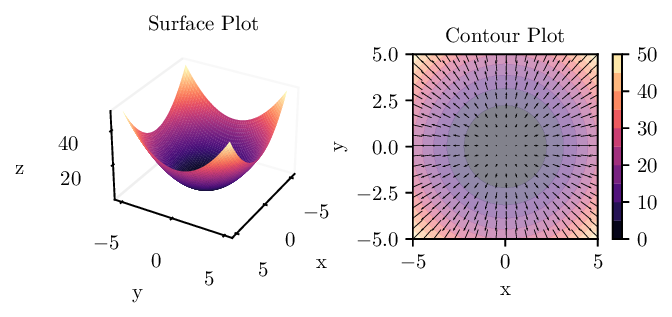
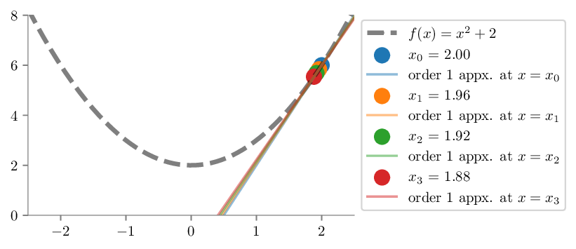
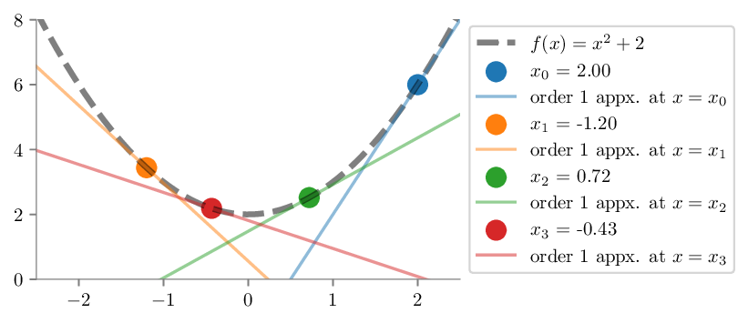
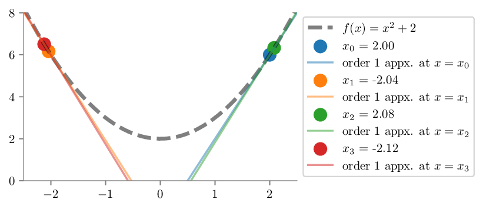
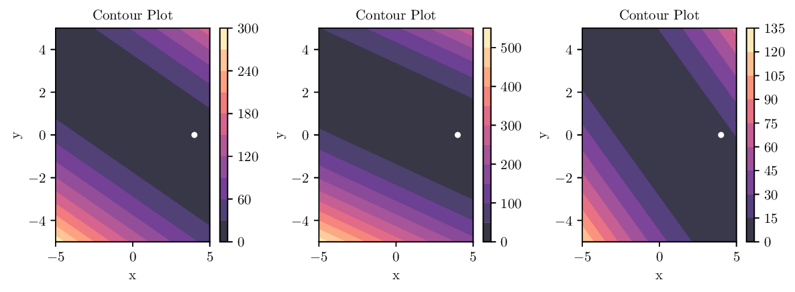

# Gradient Descent
*Nipun Batra, IIT Gandhinagar*

---

## Revision: Contour Plot And Gradients

$z = f(x,y) = x^{2} + y^{2}$

**Gradient** denotes the direction of steepest ascent or the direction in which there is a maximum increase in f(x,y)

$$\nabla f(x, y) = \begin{bmatrix}
\frac{\partial f(x, y)}{\partial x}\\
\frac{\partial f(x, y)}{\partial y}
\end{bmatrix} = \begin{bmatrix} 2x\\2y
\end{bmatrix}$$

---

## Optimization Algorithms

### Core Concepts

- We often want to minimize/maximize a function
- We wanted to minimize the cost function:
  $$f(\theta) = (y-X\theta)^T(y-X\theta)$$
- Note: here $\theta$ is the parameter vector

### General Components

- **Maximize or Minimize** a function subject to some constraints
- Today, we focus on **unconstrained optimization** (no constraints)
- We focus on **minimization**
- **Goal**: 
  $$\theta^* = \underset{\theta}{\arg\min}  f(\theta)$$

---

## Introduction to Gradient Descent

### Key Properties

- Gradient descent is an **optimization algorithm**
- Used to find the minimum of a function in unconstrained settings
- It is an **iterative algorithm**
- It is a **first order** optimization algorithm  
- It is a **local search algorithm/greedy**

### Algorithm Steps

1. **Initialize** $\theta$ to some random value
2. **Compute** the gradient of the cost function at $\theta$: $\nabla f(\theta)$
3. **For Iteration** $i$ ($i = 1,2,\ldots$) or until convergence:
   - $\theta_{i} \gets \theta_{i-1} - \alpha \nabla f(\theta_{i-1})$

---

## Taylor's Series Foundation

### Basic Form

Taylor's series approximates a function $f(x)$ around point $x_0$ using a polynomial:

$$f(x) = f(x_0) + \frac{f'(x_0)}{1!}(x-x_0) + \frac{f''(x_0)}{2!}(x-x_0)^2 + \ldots$$

### Vector Form

$$f(\vec{x}) = f(\vec{x_0}) + \nabla f(\vec{x_0})^T(\vec{x}-\vec{x_0}) + \frac{1}{2}(\vec{x}-\vec{x_0})^T\nabla^2 f(\vec{x_0})(\vec{x}-\vec{x_0}) + \ldots$$

where $\nabla^2 f(\vec{x_0})$ is the **Hessian matrix** and $\nabla f(\vec{x_0})$ is the **gradient vector**

### First Order Approximation

For small $\Delta x$, ignoring higher order terms:

$$f(x_0 + \Delta x) \approx f(x_0) + f'(x_0)\Delta x$$

In vector form:
$$f(\vec{x_0} + \Delta \vec{x}) \approx f(\vec{x_0}) + \nabla f(\vec{x_0})^T\Delta \vec{x}$$

---

## From Taylor's Series to Gradient Descent

### Minimization Logic

- **Goal**: Find $\Delta \vec{x}$ such that $f(\vec{x_0} + \Delta \vec{x})$ is minimized
- This is equivalent to minimizing $f(\vec{x_0}) + \nabla f(\vec{x_0})^T\Delta \vec{x}$
- This happens when vectors $\nabla f(\vec{x_0})$ and $\Delta \vec{x}$ are at phase angle of $180°$
- **Solution**: $\Delta \vec{x} = -\alpha \nabla f(\vec{x_0})$ where $\alpha$ is a scalar

### The Gradient Descent Update Rule

$$\vec{x_1} = \vec{x_0} - \alpha \nabla f(\vec{x_0})$$

---

## Effect of Learning Rate

### Low Learning Rate ($\alpha=0.01$)
*Converges slowly*

---

## Effect of Learning Rate

### High Learning Rate ($\alpha=0.8$)
*Converges quickly, but might overshoot*

---

## Effect of Learning Rate

### Very High Learning Rate ($\alpha=1.01$)
*Diverges*

---

## Effect of Learning Rate

### Appropriate Learning Rate ($\alpha=0.1$)
*Just right*

---

## Terminology: Loss vs Cost vs Objective

### Loss Function
- Usually defined on a **data point, prediction and label**
- Measures the penalty
- Example: Square loss $l(f(x_i | \theta), y_i) = (f(x_i | \theta) - y_i)^2$

### Cost Function  
- More general: **sum of loss functions** over training set plus **model complexity penalty**
- Example: Mean Squared Error $MSE(\theta) = \frac{1}{N} \sum_{i=1}^{N}(f(x_i | \theta) - y_i)^2$

### Objective Function
- **Most general term** for any function optimized during training

---

## Gradient Descent Example

Learn $y = \theta_0 + \theta_1 x$ using gradient descent:
- Initial: $(\theta_0, \theta_1) = (4,0)$  
- Step-size: $\alpha = 0.1$
- Dataset:

| x | y |
|---|---|
| 1 | 1 |
| 2 | 2 |
| 3 | 3 |

### Error Calculation

- Predictor: $\hat{y} = \theta_0 + \theta_1x$
- Error for $i^{th}$ datapoint: $\epsilon_i = y_i - \hat{y_i}$
- $\epsilon_1 = 1 - \theta_0 - \theta_1$
- $\epsilon_2 = 2 - \theta_0 - 2\theta_1$ 
- $\epsilon_3 = 3 - \theta_0 - 3\theta_1$

**MSE** = $\frac{\epsilon_1^2 + \epsilon_2^2 + \epsilon_3^2}{3}$

---

## Gradient Computation

### Partial Derivatives

$$\frac{\partial MSE}{\partial \theta_0} = \frac{2\sum_i (y_i - \theta_0 - \theta_1x_i)(-1)}{N} = \frac{2\sum_i \epsilon_i(-1)}{N}$$

$$\frac{\partial MSE}{\partial \theta_1} = \frac{2\sum_i (y_i - \theta_0 - \theta_1x_i)(-x_i)}{N} = \frac{2\sum_i \epsilon_i(-x_i)}{N}$$

### Update Rules

$$\theta_0 = \theta_0 - \alpha\frac{\partial MSE}{\partial \theta_0}$$
$$\theta_1 = \theta_1 - \alpha\frac{\partial MSE}{\partial \theta_1}$$

---

## Algorithm Variants

### Gradient Descent (GD)
- Dataset: $D = \{(X, y)\}$ of size $N$
- **For each epoch:**
  - Predict $\hat{y} = pred(X, \theta)$ 
  - Compute loss: $J(\theta) = loss(y, \hat{y})$
  - Compute gradient: $\nabla J(\theta) = grad(J)(\theta)$
  - Update: $\theta = \theta - \alpha \nabla J(\theta)$

### Stochastic Gradient Descent (SGD)
- **For each epoch:**
  - Shuffle $D$
  - **For each sample** $i$ in $[1, N]$:
    - Predict $\hat{y_i} = pred(X_i, \theta)$
    - Compute loss: $J(\theta) = loss(y_i, \hat{y_i})$ 
    - Update: $\theta = \theta - \alpha \nabla J(\theta)$

### Mini-Batch Gradient Descent (MBGD)
- **For each epoch:**
  - Create batches of size $B$
  - **For each batch** $b$:
    - Process batch and update parameters

---

## SGD vs Gradient Descent

### Vanilla Gradient Descent
- Updates parameters **after going through all data**
- **Smooth curve** for Iteration vs Cost
- Takes **more time** per update (computes gradient over all samples)

### Stochastic Gradient Descent  
- Updates parameters **after seeing each point**
- **Noisier curve** for iteration vs cost
- **Less time** per update (gradient over one example)

### SGD Contour Visualization

---

## Mathematical Foundation: Unbiased Estimator

### True Gradient
For dataset $\mathcal{D} = \{(x_1, y_1), (x_2, y_2), \ldots, (x_N, y_N)\}$:

$$L(\theta) = \frac{1}{N}\sum_{i=1}^{N}loss(f(x_i, \theta), y_i)$$

**True gradient:**
$$\nabla L = \frac{1}{n} \sum_{i=1}^n \nabla \operatorname{loss}(f(x_i), y_i)$$

### SGD Estimator
For single sample $(x, y)$:
$$\nabla \tilde{L} = \nabla \operatorname{loss}(f(x), y)$$

### Unbiased Property
$$\mathbb{E}[\nabla \tilde{L}] = \sum_{i=1}^n \frac{1}{n} \nabla \operatorname{loss}(f(x_i), y_i) = \nabla L$$

**Therefore**: SGD gradient is an **unbiased estimator** of the true gradient!

---

## Computational Complexity Analysis

### Normal Equation: $\hat{\theta} = (X^TX)^{-1}X^Ty$

For $X \in \mathbb{R}^{N \times D}$:
- $X^TX$: $\mathcal{O}(D^2N)$
- Matrix inversion: $\mathcal{O}(D^3)$ 
- $X^Ty$: $\mathcal{O}(DN)$
- Final multiplication: $\mathcal{O}(D^2)$

**Total complexity**: $\mathcal{O}(D^2N + D^3)$

### Gradient Descent

**Vectorized update**: $\theta = \theta - \alpha X^T(X\theta - y)$

**Efficient form**: $\theta = \theta - \alpha X^TX\theta + \alpha X^Ty$

- Pre-compute $X^TX$ and $X^Ty$: $\mathcal{O}(D^2N)$
- Per iteration: $\mathcal{O}(D^2)$ 
- For $t$ iterations: $\mathcal{O}(D^2N + tD^2) = \mathcal{O}((N+t)D^2)$

**Alternative form**: $\mathcal{O}(NDt)$ per iteration

### When to Use Which?
- **Normal Equation**: Good when $D$ is small
- **Gradient Descent**: Better when $D$ is large or $N$ is large

---

## Summary

### Key Takeaways

1. **Gradient Descent** is a fundamental optimization algorithm
2. **Learning rate** $\alpha$ is crucial - too small (slow), too large (divergence)
3. **SGD** provides unbiased estimates with faster per-iteration updates
4. **Computational complexity** depends on problem dimensions
5. **Taylor series** provides theoretical foundation

### Applications
- Linear regression
- Logistic regression  
- Neural networks
- Any differentiable optimization problem

*Gradient descent: following the steepest path downhill!*